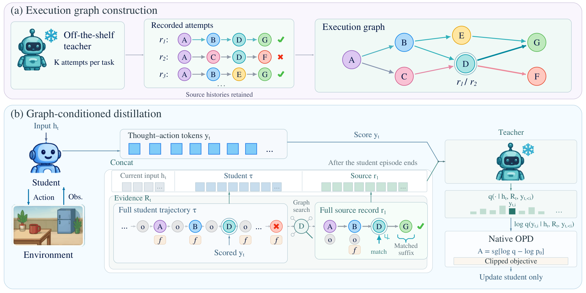
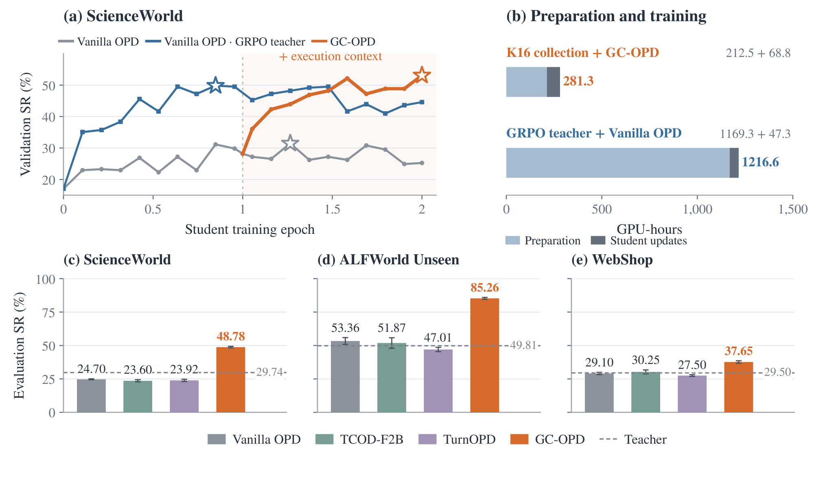

# GC-OPD

**Graph-Conditioned On-Policy Agent Distillation from Off-the-Shelf Teachers**

[Paper](https://arxiv.org/abs/2609.37522) · [Code](https://github.com/hanyi2021/GC_OPD)

Official implementation of **GC-OPD**, which organizes recorded task executions into a graph and retrieves relevant successful and failed histories to improve teacher feedback during on-policy agent distillation. The repository covers ScienceWorld, ALFWorld and WebShop.

## Method



## Results



Figures and results are from the paper.

## Models

The eight BF16 models cover GC-OPD and GC-OPD+GA at each environment/size. GA denotes graph augmentation with planner/oracle executions.

| Environment | Student | GC-OPD model | GC-OPD+GA model |
|---|---|---|---|
| ScienceWorld | Qwen3-1.7B | `gc-opd-scienceworld-qwen3-1.7b` | `gc-opd-scienceworld-qwen3-1.7b-ga` |
| ScienceWorld | Qwen3-4B | `gc-opd-scienceworld-qwen3-4b` | `gc-opd-scienceworld-qwen3-4b-ga` |
| ALFWorld | Qwen3-1.7B | `gc-opd-alfworld-qwen3-1.7b` | `gc-opd-alfworld-qwen3-1.7b-ga` |
| WebShop | Qwen3.5-0.8B | `gc-opd-webshop-qwen3.5-0.8b` | `gc-opd-webshop-qwen3.5-0.8b-ga` |

To evaluate a model, use its complete local Hugging Face directory as `--model` in [Evaluate an existing model](#evaluate-an-existing-model). Each model card includes its paper results and inference settings.

## Installation

Run all commands from the repository root. Training and evaluation use **Python 3.12, PyTorch 2.11.0, Transformers 5.5.3, vLLM 0.20.0 and FlashAttention 2.8.3**.

```bash
conda create -n gcopd python=3.12 -y
conda activate gcopd
python -m pip install -r requirements.txt
python -m pip install --no-build-isolation flash-attn==2.8.3
python -m pip check
```

Install FlashAttention after Torch. Use wheels compatible with your NVIDIA driver and CUDA installation; building CUDA extensions from source also requires the CUDA toolkit and a C++ compiler. See the [vLLM installation guide](https://docs.vllm.ai/en/latest/getting_started/installation/gpu/).

Install the benchmark simulators and download their official data:

| Environment | Setup |
|---|---|
| [ScienceWorld](https://github.com/allenai/ScienceWorld) | Java 17; `python -m pip install scienceworld==1.2.3 py4j==0.10.9.9` in the model environment |
| [ALFWorld](https://github.com/alfworld/alfworld) | Python 3.10 simulator environment with `alfworld==0.4.2` and `textworld==1.7.0`; run `alfworld-download` there |
| [WebShop](https://github.com/princeton-nlp/WebShop) | Clone the official project and follow its setup for the full product data and search indexes; use a separate simulator environment with Gym/Pyserini and JDK 11 |

ALFWorld and WebShop simulators communicate with the shared model runtime through a Python worker or an HTTP service. Set `/envs/alfworld/bin/python` and `/envs/webshop/bin/python` below to those simulator interpreters.

Prepare the veRL backend for each environment you use:

```bash
python scripts/setup_backend.py --profile scienceworld
python scripts/setup_backend.py --profile alfworld
python scripts/setup_backend.py --profile webshop
```

Each command downloads veRL commit `483b8a009ba3a97563edee3a19887e4862b8094a` and applies the corresponding patch. Add `--check` to verify a checkout, or `--source-checkout /path/to/verl` to use a local checkout. Generated files live under `external/verl/<environment>/`.

## Prepare tasks and sample teacher trajectories

The workflow is **K16 teacher sampling → graph construction → optional GA → OPD → GC-OPD → evaluation**. Collect 16 executions per training task, retaining both successes and failures.

### ScienceWorld

The task lists are supplied under `gcopd/scienceworld/manifests/`. Start the Qwen3-32B sampling service in a separate terminal:

```bash
CUDA_VISIBLE_DEVICES=0,1,2,3 python -m gcopd.scienceworld.serve_teacher \
  --model /models/Qwen3-32B --served-model teacher \
  --tensor-parallel-size 4 --port 8000
```

Sample and replay the training executions:

```bash
python -m gcopd.scienceworld.collect \
  --train-tasks gcopd/scienceworld/manifests/train_tasks.json \
  --endpoint http://127.0.0.1:8000/v1 --served-model teacher \
  --model-path /models/Qwen3-32B --workers 4 --output runs/sw_sources
python -m gcopd.scienceworld.build_graph \
  --train-tasks gcopd/scienceworld/manifests/train_tasks.json \
  --source-results runs/sw_sources/results --workers 4 --output runs/sw_graph
```

### ALFWorld

After downloading the official games, create `/data/alf_train.json` from the training directory. Each entry is a path relative to `/data/alfworld/json_2.1.1`:

```bash
python - <<'PYTHON'
import json
from pathlib import Path
root = Path("/data/alfworld/json_2.1.1")
tasks = sorted(p.relative_to(root).as_posix() for p in (root / "train").rglob("game.tw-pddl"))
if not tasks:
    raise ValueError("No training games found; check the downloaded data root")
Path("/data/alf_train.json").write_text(json.dumps(tasks, indent=2) + "\n")
PYTHON
```

Use the same task list and ordering for sampling, graph construction and training.

ALFWorld collection loads the teacher directly; no model HTTP server is needed:

```bash
CUDA_VISIBLE_DEVICES=0,1,2,3 python -m gcopd.alfworld.collect \
  --model /models/Qwen3-32B --tasks /data/alf_train.json \
  --data-root /data/alfworld/json_2.1.1 --env-python /envs/alfworld/bin/python \
  --run-dir runs/alf_sources --reps 16 --tp 4
python -m gcopd.alfworld.build_graph --tasks /data/alf_train.json \
  --episodes runs/alf_sources/episodes --data-root /data/alfworld/json_2.1.1 \
  --env-python /envs/alfworld/bin/python --output runs/alf_graph --reps 16
```

### WebShop

With the official goal shuffle seed 233, use training goals 1500–4499, development goals 500–699 and test goals 0–499. Generate the two input lists:

```bash
python - <<'PYTHON'
import json
from pathlib import Path
Path("/data").mkdir(parents=True, exist_ok=True)
Path("/data/web_train.json").write_text(json.dumps(list(range(1500, 4500))) + "\n")
Path("/data/web_validation_goals.json").write_text(json.dumps(list(range(500, 700))) + "\n")
PYTHON
```

Use the official full product dataset with goal shuffle seed 233.

Start the benchmark service in the simulator environment:

```bash
JAVA_HOME=/path/to/jdk11 /envs/webshop/bin/python -m gcopd.webshop.serve_environment \
  --webshop-root /data/WebShop --seed 42 --goal-shuffle-seed 233 --port 8300
```

Start the teacher sampling service in another terminal:

```bash
CUDA_VISIBLE_DEVICES=0,1,2,3 python -m vllm.entrypoints.openai.api_server \
  --model /models/Qwen3.8-27B --served-model-name teacher \
  --tensor-parallel-size 4 --dtype bfloat16 --max-model-len 65536 --port 8000
```

Then sample and replay the training executions:

```bash
python -m gcopd.webshop.collect --tasks /data/web_train.json \
  --env-url http://127.0.0.1:8300 --llm-url http://127.0.0.1:8000 --model teacher \
  --reps 16 --output runs/web_sources
python -m gcopd.webshop.build_graph --tasks /data/web_train.json \
  --episodes runs/web_sources --env-url http://127.0.0.1:8300 \
  --reps 16 --output runs/web_graph
```

## Add graph augmentation (GA)

GA adds actual planner/oracle executions to the teacher-source graph. Retain the original K16 sources, execute the extra actions in the same training environment, replay them, and preserve their source identities and observed outcomes. A proposed action sequence alone is not an execution record.

### ScienceWorld

After building `runs/sw_graph`, run:

```bash
python -m gcopd.scienceworld.augment_graph \
  --catalog runs/sw_graph \
  --train-tasks gcopd/scienceworld/manifests/train_tasks.json \
  --output runs/sw_graph_ga --workers 4
```

This executes ScienceWorld's built-in gold-path planner, replays its actions, and writes a separate augmented catalog. Use `runs/sw_graph_ga` as `graph_catalog` for GC training. Keep the original source directories because the catalog retains their paths and checksums.

For the full ScienceWorld pipeline, set `"planner_augmentation": true` in its JSON configuration; it performs this step automatically. With `"recipe": "scienceworld_1p7b"`, it also enables the final-response annotation on naturally terminated negative-score failures, excluding horizon and technical stops. When preparing that 1.7B GA run manually, add `--terminal-failure-note` to `train prepare --phase gc`. The 4B recipe does not use this annotation.

### ALFWorld

Generate planner executions in the ALFWorld simulator environment, then merge them into the K16 graph:

```bash
/envs/alfworld/bin/python -m gcopd.alfworld.collect_planner \
  --tasks /data/alf_train.json --data-root /data/alfworld/json_2.1.1 \
  --output runs/alf_planner --workers 4
python -m gcopd.alfworld.augment_graph \
  --tasks /data/alf_train.json --catalog runs/alf_graph \
  --planner-sources runs/alf_planner --output runs/alf_graph_ga
```

The collector uses TextWorld's Fast Downward planner, executes at most 30 decisions, and independently replays the actions in a fresh environment without planner queries. The merger adds only successful, replay-verified plans of 1–30 decisions. It retains the original 16 teacher sources and all training tasks, including tasks without an eligible plan. Per-task catalogs store `teacher_K=16` and `K=len(sources)` (16 or 17); the task manifest records each resulting K. A planner timeout or technical failure stops collection rather than becoming an unsuccessful task record. Re-run the same collection command to reuse completed records.

Use `--catalog runs/alf_graph_ga` in the ALFWorld training command.

### WebShop

Keep the WebShop environment service running from this release. Run the oracle collector in the WebShop simulator environment, which supplies the official reward/normalization helpers and full product data:

```bash
/envs/webshop/bin/python -m gcopd.webshop.collect_planner \
  --tasks /data/web_train.json --catalog runs/web_graph \
  --env-url http://127.0.0.1:8300 --webshop-root /data/WebShop \
  --output runs/web_planner --workers 4
python -m gcopd.webshop.augment_graph \
  --tasks /data/web_train.json --catalog runs/web_graph \
  --planner-sources runs/web_planner --env-url http://127.0.0.1:8300 \
  --output runs/web_graph_ga
```

The oracle uses training-goal product information and performs actual search, option-selection and purchase actions. It first executes the original target-product oracle. For failed original oracle executions, it applies the historical query-rewrite, equivalent-product, broad-search, full-catalog and query-filter refinements in order. Each candidate execution has a 15-decision limit; the search may try several candidates. Catalog scans can be CPU-intensive. Refinement is independent of the current teacher's success rate. To replay a specific historical source-generation scope, supply `--refinement-tasks /data/refinement_goals.json` and `--query-filter-tasks /data/query_filter_goals.json`; both contain subsets of the training goal IDs. Without these options, refinements cover failed original oracle executions and v6 covers the remaining unresolved goals. The historical v6 script targeted goal 4230; its corresponding task list is `[4230]`.

The collector retains the original oracle execution, including failures, as source 16. It adds at most one independently replayed successful refinement as source 17. The merger preserves all K16 teacher sources, rechecks the extra executions against the environment, and copies the source files into a separate augmented catalog. Candidate product matches alone never count as successful trajectories.

Use `--catalog runs/web_graph_ga` in the WebShop training command. Both GA collectors operate on the supplied training task lists; use the same lists and environment data for sampling, augmentation and training.

## Train

The default allocation is four student/rollout GPUs and four single-GPU teacher replicas (TP=1). A single 32B teacher uses a 96 GB GPU; increase teacher tensor parallelism for other hardware. Teacher prefill uses 1,024-token chunks. Stop the sampling server before reusing its GPUs for training, or allocate it a separate GPU pool.

### ScienceWorld

For a complete run from source collection onward, edit `gcopd/scienceworld/configs/pipeline.example.json` with your model paths, endpoint and resources, then run:

```bash
python -m gcopd.scienceworld.pipeline \
  --config gcopd/scienceworld/configs/pipeline.example.json \
  --output runs/scienceworld --execute
```

The pipeline runs data preparation, sampling, graph construction, optional GA, one OPD epoch, one GC epoch, development evaluation and four-repeat test evaluation. Use a fresh output directory. The automatic pipeline keeps running from sampling into training, so reserve separate GPUs for its externally managed sampling service: the default allocation is 8 training GPUs plus 4 sampling GPUs. For example, run the sampling service with `CUDA_VISIBLE_DEVICES=8,9,10,11` and the pipeline with `CUDA_VISIBLE_DEVICES=0,1,2,3,4,5,6,7`. On an 8-GPU machine, use the staged commands below and stop the sampling server after collection before starting training.

To reuse sources and graphs already built above, first prepare task data:

```bash
python -m gcopd.scienceworld.prepare_data \
  --train gcopd/scienceworld/manifests/train_tasks.json \
  --dev gcopd/scienceworld/manifests/dev_tasks.json \
  --test gcopd/scienceworld/manifests/test_tasks.json --output runs/sw_data
```

Create `runs/sw_assets.json` with the following paths, resolved relative to that file:

```json
{
  "student_model": "/models/Qwen3-1.7B",
  "teacher_model": "/models/Qwen3-32B",
  "train_parquet": "sw_data/train.parquet",
  "dev_parquet": "sw_data/dev.parquet",
  "graph_catalog": "sw_graph"
}
```

Prepare and execute OPD, then GC from the last checkpoint of that OPD epoch. The supplied 3,017-task training list produces 95 updates per epoch:

```bash
python -m gcopd.scienceworld.train prepare --phase opd --recipe scienceworld_1p7b \
  --assets runs/sw_assets.json --output runs/sw_opd
python -m gcopd.scienceworld.train execute runs/sw_opd/PREPARED_RUN.json
python -m gcopd.scienceworld.train prepare --phase gc --recipe scienceworld_1p7b \
  --assets runs/sw_assets.json --parent runs/sw_opd/checkpoints/global_step_95 \
  --output runs/sw_gc
python -m gcopd.scienceworld.train execute runs/sw_gc/PREPARED_RUN.json
```

For 4B, use `--recipe scienceworld_4b` and its student model path. For GA, change `graph_catalog` to `sw_graph_ga` and apply the 1.7B annotation option described above.

### ALFWorld

```bash
python -m gcopd.alfworld.pipeline --tasks /data/alf_train.json \
  --student-model /models/Qwen3-1.7B --teacher-model /models/Qwen3-32B \
  --catalog runs/alf_graph --data-root /data/alfworld/json_2.1.1 \
  --env-python /envs/alfworld/bin/python --output runs/alf_training --execute
```

### WebShop

Keep the WebShop environment service running:

```bash
python -m gcopd.webshop.pipeline --tasks /data/web_train.json \
  --student-model /models/Qwen3.5-0.8B --teacher-model /models/Qwen3.8-27B \
  --catalog runs/web_graph --env-url http://127.0.0.1:8300 \
  --output runs/web_training --execute
```

Both pipelines prepare training data and run one OPD epoch followed by one GC epoch, restoring the complete final OPD checkpoint. Their checkpoints are saved under the output directory's `opd/checkpoints/` and `gc/checkpoints/`.

## Evaluate an existing model

Use the unified model runtime installed above. The commands below evaluate student models directly, including GA variants. Only the model path changes between the two variants of the same environment and size.

### ScienceWorld

If `runs/sw_data` already exists from training preparation, reuse it and skip the first command. Otherwise, prepare it once:

```bash
python -m gcopd.scienceworld.prepare_data \
  --train gcopd/scienceworld/manifests/train_tasks.json \
  --dev gcopd/scienceworld/manifests/dev_tasks.json \
  --test gcopd/scienceworld/manifests/test_tasks.json --output runs/sw_data
python -m gcopd.scienceworld.evaluate --recipe scienceworld_1p7b \
  --model /models/gc-opd-student --tasks runs/sw_data/test.parquet \
  --rep 0 --gpus 1 --output runs/sw_eval --ray-address local
python -m gcopd.scienceworld.train execute runs/sw_eval/PREPARED_RUN.json
python -m gcopd.scienceworld.summarize runs/sw_eval --output runs/sw_eval_summary.json
```

For 4B use `--recipe scienceworld_4b`; for validation, use `dev.parquet`. For four repeats, run reps 0–3 in separate directories and pass them to `summarize`.

### ALFWorld

```bash
python -m gcopd.alfworld.evaluate --model /models/gc-opd-student --backend vllm \
  --data-root /data/alfworld/json_2.1.1 --env-python /envs/alfworld/bin/python \
  --reps 0 1 2 3 --output runs/alf_eval
```

The default evaluation covers 140 Seen and 134 Unseen tasks.

### WebShop

Use the JSON environment service started above:

```bash
python -m gcopd.webshop.evaluate --model /models/gc-opd-student --backend vllm \
  --env-url http://127.0.0.1:8300 --reps 0 1 2 3 --output runs/web_eval
```

The default test covers goals 0–499. For validation, add `--tasks /data/web_validation_goals.json --reps 0` and use a separate output directory.

## Code layout

```text
gcopd/
  scienceworld/  alfworld/  webshop/   # Environment commands and implementations
  training/                           # Shared batch, token alignment and context checks
  inference/                          # Model loading and evaluation
  common/                             # IO, resources and compatibility helpers
scripts/                              # Framework setup and optional shard conversion
patches/                              # Environment-specific veRL changes
figures/                              # Paper figures
requirements.txt                      # Unified model runtime and Python dependencies
LICENSE
```

Each environment's `references/` selects and renders execution evidence, `adapter/` handles rollout, and `configs/` contains its training configuration. ALFWorld and WebShop add `collect_planner.py` and `augment_graph.py` for GA generation and graph merging; WebShop's `planner.py` contains the oracle search helpers. Models, benchmark data, upstream repositories and training outputs are not bundled.

## License and attribution

GC-OPD is released under [Apache-2.0](LICENSE). The same license text applies to the retained Apache-2.0 upstream components; their copyright headers remain in the source and patches.

- **veRL:** [verl-project/verl](https://github.com/verl-project/verl), fixed commit `483b8a009ba3a97563edee3a19887e4862b8094a`. The patches retain upstream context and copyright notices. The full upstream repository is downloaded separately.
- **TCOD:** ScienceWorld and ALFWorld task/history templates are adapted from [kokolerk/TCOD](https://github.com/kokolerk/TCOD), commit `465eef4406ad0cff675b36bd46f37f28b1736ff9`, under Apache-2.0. Adaptations include `<thought>` tags and the documented history/interaction rules.
- **WebShop templates:** Copyright 2025 Nanyang Technological University (NTU), Singapore, and the verl-agent (GiGPO) team, under Apache-2.0. The notice is retained in `gcopd/webshop/protocol.py`.
- **Benchmark environments, libraries and models:** ScienceWorld, ALFWorld, TextWorld, WebShop, Pyserini, Qwen and the installed runtime libraries retain their respective licenses. Their full source trees, datasets and model weights are not redistributed in this code package.

## Citation

```bibtex
@misc{yi2026gcopd,
  title = {Graph-Conditioned On-Policy Agent Distillation from Off-the-Shelf Teachers},
  author = {Xiaohan Yi and Wen Luo and Yani Huang and Junfeng Zhan and Asher Qin and Peilin Zhao and Xi Xiao},
  year = {2026},
  eprint = {2609.37522},
  archivePrefix = {arXiv},
  url = {https://arxiv.org/abs/2609.37522}
}
```
